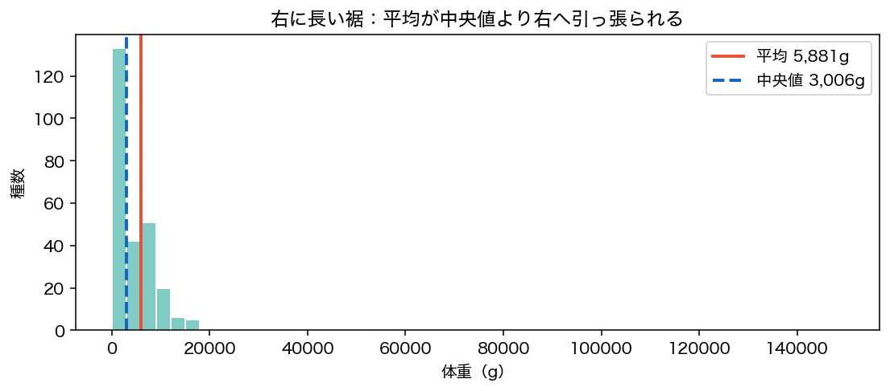

<!-- _class: lead -->
# 第2回　代表値の性質と、その嘘
## 「平均的な人」は実在するか

統計学Ⅰ（B）　北星学園大学
小野原 彩香

---

## 今日のゴール

1. 平均・中央値・最頻値の**性質の違い**
2. 分布が歪むと、平均は「真ん中」を表さなくなる
3. 外れ値は**消していいのか**を判断できる

到達目標 **G1（記述統計）**

---

## 3つの代表値

| 代表値 | 定義 | ひとことで |
|---|---|---|
| 平均値 | 全部足して個数で割る | 等しく分けたら一人いくら |
| 中央値 | 順に並べた真ん中 | ちょうど真ん中の人 |
| 最頻値 | 最も多い値 | いちばんありがちな値 |

どれも「代表」。でも**別物**。

---

## クイズ

ニュース：「日本人の**平均**貯蓄額は◯◯万円」

 

## あなたの実感より、高くない？

その違和感、正しいかもしれない。

---

## 霊長類 265種の体重

| 代表値 | 値 |
|---|---|
| 平均値 | **5,881 g** |
| 中央値 | **3,006 g** |
| 最大値 | 149,325 g（ヒガシゴリラ）← 犯人 |
| 最小値 | 31 g（ネズミキツネザル） |

 

**平均は中央値のほぼ2倍。**最大と最小は4,800倍ちがう

---

## なぜズレる？

右に裾を引く → 平均（赤）が山より右へ引っ張られる

---

## 外れ値を除くと…

| | 平均 | 中央値 |
|---|---|---|
| 全265種 | 5,881 g | 3,006 g |
| ヒト科7種を除く | **4,127 g** | 2,797 g |

 

- 平均は**1,754g も動く**（外れ値に弱い）
- 中央値は**209g しか動かない**（頑健 robust）　→ 動いた量は **8.4倍** 違う

---

## 外れ値は消していい？

## → 理由を言えるかどうか

- 入力ミス（身長1710cm）→ 訂正・除外OK
- 本物の富裕層 → 勝手に消すのは**捏造**
- 「平均を下げたいから消す」→ **禁じ手**

迷ったら「中央値で報告」or「両方示す」

---

## 対称なら3つは一致する

`妊娠期間日`：平均164.4日 / 中央値165.5日（歪度 −0.06）→ ほぼ同じ

 

歪んでいるからズレる。**いつもズレるわけではない。**
だから――**まず分布の形（ヒストグラム）を見る。**

---

<!-- _class: lead -->
# まとめ

## 代表値の選択は中立ではない
## どれを選ぶかは、すでに一つの「主張」

### 数字を見たら、まず分布の形を疑え

次回：ばらつきを測る（分散・標準偏差）
