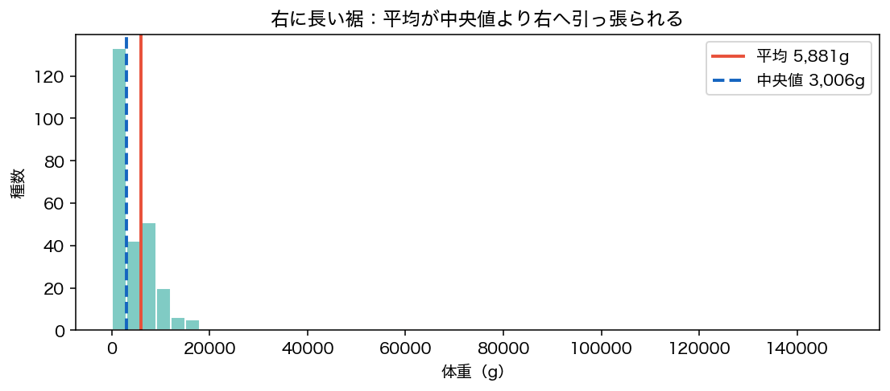

<!-- _class: lead -->
# 第2回　代表値の性質と、その嘘
## 「平均的な人」は実在するか

統計学Ⅰ（B）　北星学園大学
小野原 彩香

---

## 今日のゴール

1. 平均・中央値・最頻値の**性質の違い**
2. 平均が「順位上の真ん中」「最も多い値」を表すとは限らない
3. 外れ値は**消していいのか**を判断できる

到達目標 **G1（記述統計）**

---

<!-- _class: lead -->
# 第1回の復習
## そして、実際にあった間違い

---

## 第1回で確認したこと

- 直感は「なんとなく」ではなく、**一定の向きに**裏切る
- モンティ・ホールの答えは、条件を整理すれば **計算だけで出せる**
- 地図：**記述統計**（第2〜3回）→ **推測統計**（第6回以降）

 

> 今日はその入口、**記述統計の1回目**

---

## 第1回の課題：パートAの誤答（83名中6名）

| 設問 | 人数 | 間違いの中身 |
|---|---|---|
| A4（回数とばらつき） | 3名 | 回数を増やすと何が変わるかの取り違え |
| A1（ドアを変えるか） | 2名 | 「変えない」を選んだ |
| A3（誕生日） | 1名 | 「23人だから約23%」（正しくは約51%） |
| A2（勝率） | 1名 | ― |

<small>足すと7になるのは、A1とA2の両方を誤った人が1名いるため</small>

記号は正答でも、本文に **別の数字**を書いた答案も1名
（「(ウ) 約67%」を選んで「約90%」と記述）

---

## つまずき①　「理論値＝1万回のときの値」

理論値 2/3 は **計算で出る値**。試行回数とは無関係

 

**なぜ起きる？**

Colab の画面では、理論値と1万回の実測値が
**同じ場所に並んで現れる**

→ 「1万回で出た数字が理論値」とつながってしまう

---

## つまずき②　「回数を増やすと当たる確率が上がる」

上がるのは **確率ではなく、推定の精度**
「変える」の勝率は **1回目からずっと 2/3**

 

**なぜ起きる？**

グラフの線が 2/3 に「上がっていく」ように見える
動いているのは **観測された割合** なのに、
**確率そのもの**が動いたと読んでしまう

→ 2つを同じ言葉で呼んでいるのが原因

---

## つまずき③　回数を1つしか試していない（約15名）

設問は「**回数を変えると**どうなるか」

1つだけでは、比べるものがない

 

**なぜ起きる？**

1万回で理論値にぴたり合うと「確かめられた」と感じる
でも **少ない回数でずれること**を見ないと、
回数が効いているのかは分からない

---

## この3つは、今日そのまま出てくる

| 第1回のつまずき | 今日どこに現れるか |
|---|---|
| ① 理論値と実測値を同一視 | 「平均」は計算で出る値。**典型的な人ではない** |
| ② 2つを同じ言葉で呼ぶ | 平均・中央値・最頻値を**ぜんぶ「真ん中」**と呼ぶ |
| ③ 1つしか試さず結論 | **代表値1つでは分布の形は分からない** |

 

> とくに② ―― 日常語の「真ん中」でまとめると、今日の話は全部ぼやける

---

## 3つの代表値

| 代表値 | 定義 | ひとことで |
|---|---|---|
| 平均値 | 全部足して個数で割る | 等しく分けたら一人いくら |
| 中央値 | 順に並べた真ん中 | ちょうど真ん中の人 |
| 最頻値 | 最も多い値 | いちばんありがちな値 |

どれも「代表」。でも**別物**。

---

## 式の読み方 ―― $\sum$ に慣れる

$$\bar{x} \;=\; \frac{1}{n}\sum_{i=1}^{n} x_i$$

| 記号 | 指しているもの |
|---|---|
| $x_i$ | $i$ 番目のデータ（$i$ は**番号を入れる箱**） |
| $n$ | データの個数（霊長類なら 265） |
| $\sum_{i=1}^{n}$ | $x_1+x_2+\cdots+x_n$ の**略記**。新しい計算ではない |
| $\bar{x}$ | 平均。横棒は「平均をとった」という印 |

**✗ よくある誤り**：$\sum$ をかけ算と思う／「$x$ を $n$ 倍」と読む

---

## 中央値と最頻値には、この式がない

 

- **中央値** … 順番に並べる **手順**
- **最頻値** … 数えて一番多いものを選ぶ **手順**

 

> 1本の式で書けるかどうかも、
> 3つの代表値の **違いのひとつ**

---

## クイズ

ニュース：「日本人の**平均**貯蓄額は◯◯万円」

 

## あなたの実感より、高くない？

その違和感、正しいかもしれない。

---

## 霊長類 265種の体重

| 代表値 | 値 |
|---|---|
| 平均値 | **5,881 g** |
| 中央値 | **3,006 g** |
| 最大値 | 149,325 g（ヒガシゴリラ）← 犯人 |
| 最小値 | 31 g（ネズミキツネザル） |

 

**平均は中央値のほぼ2倍。**最大と最小は4,800倍ちがう

---

## なぜズレる？

右に裾を引く → 平均（赤）が山より右へ引っ張られる

---

## 外れ値を除くと…

| | 平均 | 中央値 |
|---|---|---|
| 全265種 | 5,881 g | 3,006 g |
| ヒト科7種を除く | **4,127 g** | 2,797 g |

 

- 平均は**1,754g も動く**（外れ値に弱い）
- 中央値は**209g しか動かない**（頑健 robust）　→ 動いた量は **8.4倍** 違う

---

## 外れ値は消していい？

## → 理由を言えるかどうか

- 入力ミス（身長1710cm）→ 訂正・除外OK
- 本物の富裕層 → 勝手に消すのは**改ざん**（結果を歪める不適切な処理）
- 「平均を下げたいから消す」→ **禁じ手**

迷ったら「中央値で報告」or「両方示す」

---

## 対称に近いと、平均と中央値は近づく

`妊娠期間日`：平均164.4日 / 中央値165.5日（歪度 −0.06）→ ほぼ同じ

**最頻値まで一致するとは限らない**（例：1,1,2,3,4,5,5 は平均=中央値=3、最頻値は1と5）

 

体重では、少数の大きな値が平均を押し上げ、中央値との差が大きくなった。
一方この妊娠期間では、平均と中央値が近かった。
だから――**まず分布の形（ヒストグラム）を見る。**

---

<!-- _class: lead -->
# まとめ

## 代表値の選択は中立ではない
## どれを選ぶかは、すでに一つの「主張」

### 数字を見たら、まず分布の形を疑え

次回：ばらつきを測る（分散・標準偏差）
