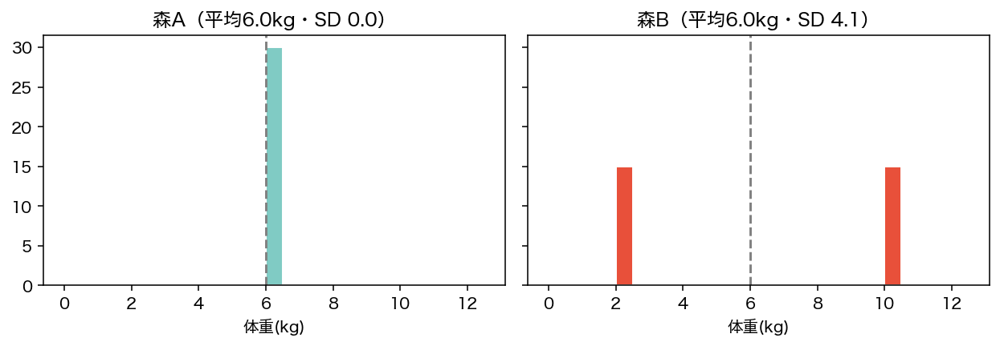
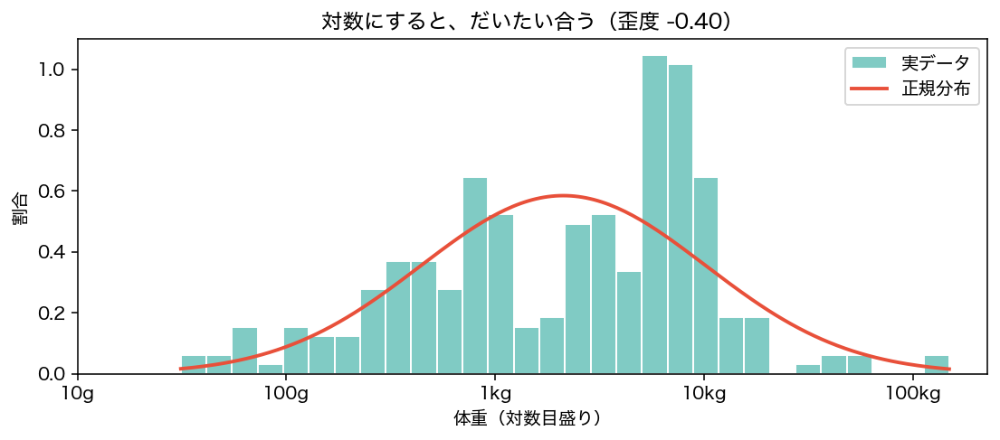
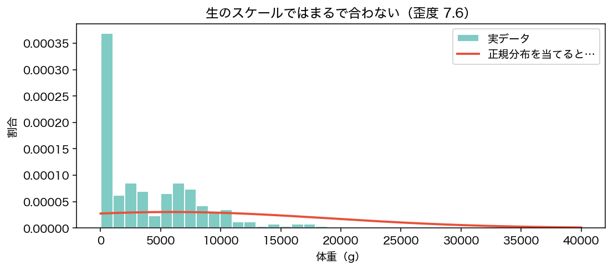

<!-- _class: lead -->
# 第3回　ばらつきを測る
## 正規分布という「仮定」

統計学Ⅰ（B）　北星学園大学
小野原 彩香

---

## 今日のゴール

1. 分散・標準偏差が**何を測っているか**
2. 偏差値の正体
3. 正規分布の 68-95-99.7 則 と、**「正規だと仮定してよいか」の確かめ方**

到達目標 **G1（記述統計）**

---

## クイズ：2つの森、どちらも平均6.0kg

## 同じような群れ？

---

## 平均だけでは分からない

- 森A：ほとんどが6kg前後（SD ≈ 0）
- 森B：半分2kg・半分10kg（SD ≈ 4.1）

 

平均は分布の **「位置」** しか表さない。
足りないのは **「散らばり」＝ばらつき**。

---

## ばらつきの測り方

1. 各データの **平均からの差**（偏差）
2. プラスマイナスが打ち消す → **二乗して平均** ＝ **分散**
3. 単位が日²で読めない → **ルートで戻す** ＝ **標準偏差(SD)**

| 妊娠期間日 | 値 |
|---|---|
| 平均 | 164.4 日 |
| 分散 | 1,427.2（日²） |
| 標準偏差 | **37.8 日** ← これを使う |

---

## 偏差値の正体

$$ 偏差値 = 50 + 10 \times \frac{値 - 平均}{標準偏差} $$

平均50・SD10 に置き直した **相対位置**

| 種 | 生スケール | 対数スケール |
|---|---|---|
| ネズミキツネザル 31g | 45.5 | 23.2 |
| ニホンザル 10kg | 53.2 | 59.9 |
| ヒガシゴリラ 149kg | **159.2** | 77.1 |

同じ80点でも、集団のSDが違えば偏差値は変わる

---

## 正規分布と 68-95-99.7 則

| 範囲 | 理論 | 対数体重 | 生の体重 |
|---|---|---|---|
| ±1SD | 68% | 71.7% | 97.4% |
| ±2SD | 95% | 94.7% | 97.4% |
| ±3SD | 99.7% | 100.0% | 98.5% |

---

## でも、すべてが正規ではない

生の体重の歪度 **+7.60**（対数なら −0.40）。正規曲線がまるで合わない。

しかも **平均−1SD = −7,254g**。体重がマイナスの動物はいない。

---

## 「正規だと仮定する」は判断

## 自然法則ではない

- 68-95-99.7則も、後で習う多くの手法も「正規」前提
- 歪んだデータに当てると**間違った結論**に
- 鉄則：**まずヒストグラムで形を見る**

---

<!-- _class: lead -->
# まとめ

## 平均は「位置」、SDは「幅」
## 両方見て初めてデータが分かる

### 正規分布は便利な仮定 ―― 当てはまるかは自分で確かめる

次回：Python統計処理入門（自分でコードを書く）
