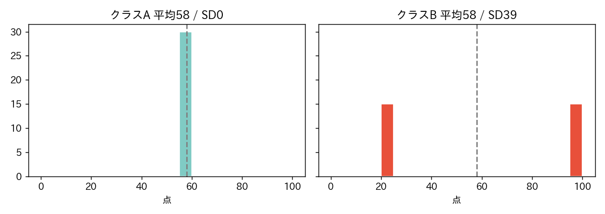

<!-- _class: lead -->
# 第3回　ばらつきを測る
## 正規分布という「仮定」

統計学Ⅰ（B）　北星学園大学
小野原 彩香

---

## 今日のゴール

1. 分散・標準偏差が**何を測っているか**
2. 偏差値の正体
3. 正規分布の 68-95-99.7 則 と、**「正規だと仮定してよいか」の確かめ方**

到達目標 **G1（記述統計）**

---

## クイズ：2つのクラス、どちらも平均58点

## 同じようなクラス？

---

## 平均だけでは分からない

- クラスA：全員ほぼ58点（SD ≈ 0）
- クラスB：半分20点・半分96点（SD ≈ 39）

 

平均は分布の **「位置」** しか表さない。
足りないのは **「散らばり」＝ばらつき**。

---

## ばらつきの測り方

1. 各データの **平均からの差**（偏差）
2. プラスマイナスが打ち消す → **二乗して平均** ＝ **分散**
3. 単位が点²で読めない → **ルートで戻す** ＝ **標準偏差(SD)**

| テスト点 | 値 |
|---|---|
| 平均 | 57.4 点 |
| 分散 | 133.8（点²） |
| 標準偏差 | **11.6 点** ← これを使う |

---

## 偏差値の正体

$$ 偏差値 = 50 + 10 \times \frac{点 - 平均}{標準偏差} $$

平均50・SD10 に置き直した **相対位置**

| テスト点 | 偏差値 |
|---|---|
| 80 | 69.6 |
| 57（≒平均） | 49.7 |
| 35 | 30.7 |

同じ80点でも、集団のSDが違えば偏差値は変わる

---

## 正規分布と 68-95-99.7 則

| 範囲 | 理論 | テスト点(実データ) |
|---|---|---|
| ±1SD | 68% | 67.0% |
| ±2SD | 95% | 94.8% |
| ±3SD | 99.7% | 99.8% |

---

## でも、すべてが正規ではない

年収の歪度 **+11.6**（テスト点は −0.09）。正規曲線がまるで合わない。

---

## 「正規だと仮定する」は判断

## 自然法則ではない

- 68-95-99.7則も、後で習う多くの手法も「正規」前提
- 歪んだデータに当てると**間違った結論**に
- 鉄則：**まずヒストグラムで形を見る**

---

<!-- _class: lead -->
# まとめ

## 平均は「位置」、SDは「幅」
## 両方見て初めてデータが分かる

### 正規分布は便利な仮定 ―― 当てはまるかは自分で確かめる

次回：Python統計処理入門（自分でコードを書く）
