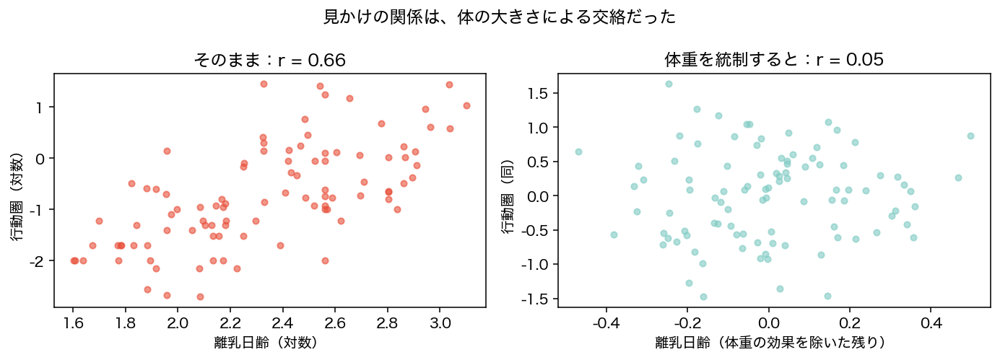
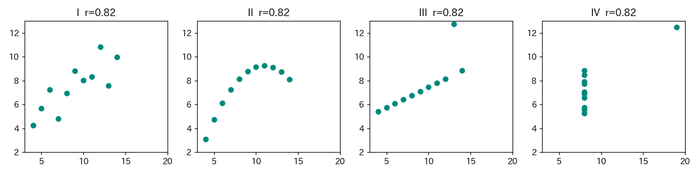

<!-- _class: lead -->
# 第5回　相関と因果
## 「相関がある」と「原因である」は別物

統計学Ⅰ（B）　北星学園大学
小野原 彩香

---

## フック：この相関を信じる？

- **アイスの売上**↑ → **水難事故**↑　アイスを禁止すべき？
- **チョコ消費**が多い国ほど**ノーベル賞**が多い　チョコで賢くなる？

<br>

相関は本物。でも結論はばかげている。
## <span class="big">なぜ？</span>

---

## 相関係数 r（−1〜+1）

| r | 意味 |
|---|---|
| +1に近い | 一緒に増える（右上がり） |
| −1に近い | 片方増で片方減（右下がり） |
| 0に近い | 直線的な関係なし |

**体重 と 行動圏：r ≈ 0.68** ← 納得のいく関係（対数）

---

## 「朝食を食べると成績UP」？



r ≈ 0.37。見出しになりそう。
でも――**本当に朝食が原因？**

---

## 交絡を疑え：第三の変数

朝食をきちんと食べる人＝**生活が規律的** → よく勉強・よく寝る

- 朝食 と 勉強の相関 **r ≈ 0.60**

```
      （生活の規律）
        ／       ＼
   離乳が遅い    行動圏が広い
```

---

## 勉強・睡眠を統制すると…

| 離乳日齢と行動圏 | r |
|---|---|
| 単純な相関 | 0.37 |
| **勉強・睡眠を統制後** | **−0.03（消えた）** |

<br>

アイス×水難（犯人=気温）、チョコ×ノーベル賞（犯人=豊かさ）と同じ。
## <span class="big">＝交絡</span>

---

## r だけ見るな：アンスコムの四重奏



全部 r=0.82。でも中身は別物。**必ず散布図を見る。**

---

## まとめ

| 注意 | 中身 |
|---|---|
| 相関 ≠ 因果 | 一緒に動いても原因とは限らない |
| 交絡 | 隠れた第三の変数 |
| 逆因果 | 原因と結果が逆かも |
| 偶然 | たまたまの相関 |

<br>

相関を見たら → **散布図を描く → 第三の変数を疑う**

---

<!-- _class: lead -->
# まとめ

## 相関は出発点であって、結論ではない
## 因果を確かめるには「実験」が要る（後の回で）

### 次回：確率分布と標本／中心極限定理
