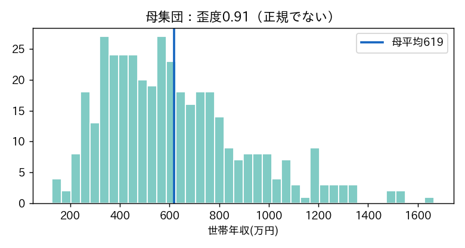
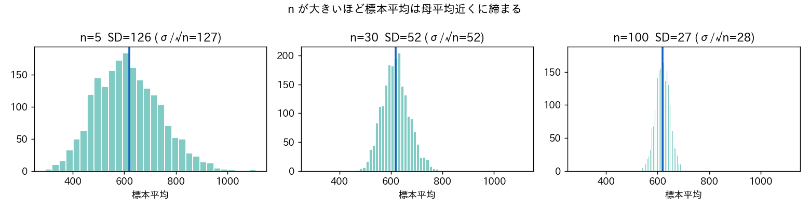
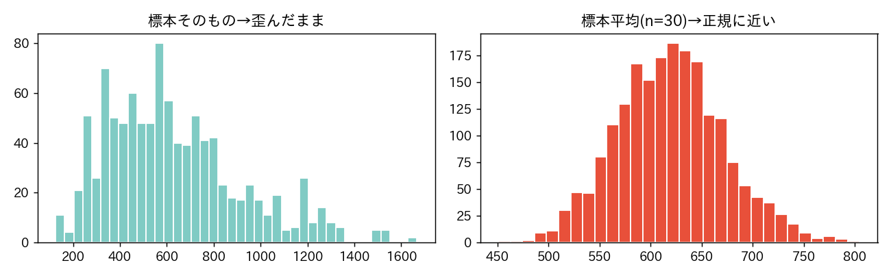

<!-- _class: lead -->
# 第6回　確率分布と標本
## 中心極限定理 ―― なぜ一部で全体が分かる

統計学Ⅰ（B）　北星学園大学
小野原 彩香

---

## フック：なぜ「一部」で「全体」？

- 視聴率は全国数千万世帯のうち**数百世帯**だけ調べる
- 味噌汁の味見は**ひと匙**で分かる

 

## なぜ一部で全体を語れる？

その裏づけ＝**中心極限定理**

---

## 母集団と標本

- **母集団**：知りたい全体
- **標本**：実際に調べる一部

母集団 μ=619 / σ=284 / 歪度0.91（**正規でない**）

---

## 標本平均を2000回くりかえすと…

母集団は歪んでいた。標本平均(n=30)の分布は？

- 標本平均の平均 ≈ **617**（母平均619にほぼ一致）
- ばらつき SD ≈ **52**
- 歪度 0.91 → **0.20**（正規に近づいた！）

## ＝中心極限定理(CLT)

---

## n を増やすと「締まる」

$$ 標準誤差\ SE = \frac{\sigma}{\sqrt{n}} $$

n を4倍 → SE は半分（精度2倍に4倍のデータ）

---

## 「標本」≠「標本平均の分布」

正規に近づくのは**標本平均の分布**。標本そのものは歪んだまま。

---

## ただし「無作為」が大前提

- 「声の大きい人」ばかり選ぶ → 数を増やしても**偏ったまま**
- 空気を読んで答えをそろえる → **独立性**が壊れる

 

## 数の多さは、偏りを直さない

「たくさん集めた」≠「正しく集めた」

---

<!-- _class: lead -->
# まとめ

## 標本平均はCLTで正規分布に従う
## だから一部から全体を語れる

### ただし無作為抽出が大前提
### 次回：点推定と区間推定／信頼区間95%の本当の意味
