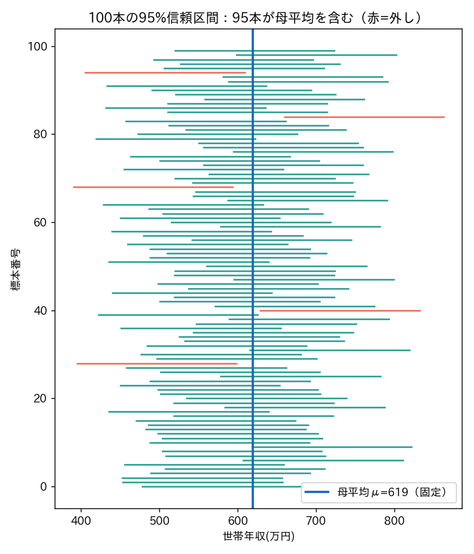

<!-- _class: lead -->
# 第7回　推定：点推定と区間推定
## 「信頼区間95%」の本当の意味

統計学Ⅰ（B）　北星学園大学
小野原 彩香

---

## まず書いてみて

> 「**95%信頼区間**」とはどういう意味？

多くの人の答え：
「真の値が**95%の確率でこの区間に入る**」

 

## ――これは誤りです

---

## 点推定 ―― 1つの値で当てる

標本平均で母平均を当てる。でも標本ごとに揺れ、必ずズレる。

| 標本 | 点推定 | 母平均(619)とのズレ |
|---|---|---|
| 1 | 580 | −39 |
| 2 | 632 | +13 |

「当たり」を言い切るが、外れ幅が分からない → **幅が欲しい**

---

## 区間推定 ―― 幅を持たせる

$$ 95\%\text{信頼区間} = \bar{x} \pm 1.96 \times SE $$

例：x̄=580, SE≈52 → **[478, 682]**（母平均619を含む）

---

## 「95%」とは何の確率？

## 母平均μは固定。動かない。

- μ=619 も、区間[478,682]も、計算すれば固定
- 固定値が固定区間に「95%で入る」は無意味
- **ランダムなのは区間のほう**（標本ごとに動く）

---

## 100本の信頼区間を描くと

100本中 **95本** が母平均（青線）を含む

---

## だから「95%」＝当たり率

「95%」＝この区間作りを繰り返すと**約95%が真値を含む**

 

手元の1本は、**当たっているか外しているかのどちらか**
（どちらかは分からない）

❌「いま手元の区間に真値が95%で入っている」

---

## 信頼度と幅のトレードオフ

| 信頼度 | 半幅 | 値(n=30) |
|---|---|---|
| 90% | 1.645×SE | 約85 |
| 95% | 1.96×SE | 約102 |
| 99% | 2.576×SE | 約134 |

確実にするほど区間は**広く＝ぼんやり**。
「100%確実」＝幅∞＝何も言っていない。

---

<!-- _class: lead -->
# まとめ

## 母平均は固定。ランダムなのは区間。
## 「95%」は手続きの当たり率

### 次回：仮説検定(1) 帰無仮説とt検定／p値の意味
