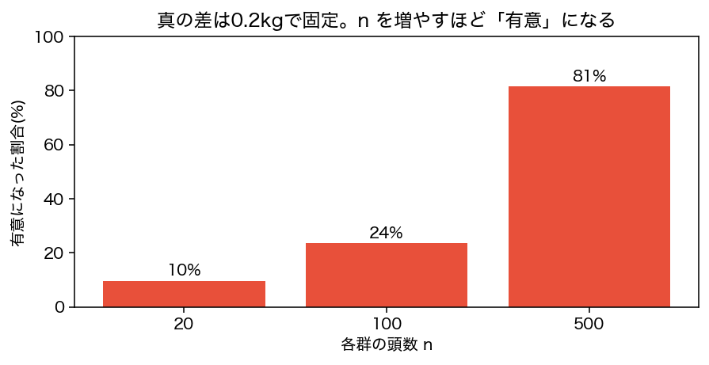

<!-- _class: lead -->
# 第8回　仮説検定(1)
## 帰無仮説とt検定 ―― 「差がある」とは

統計学Ⅰ（B）　北星学園大学
小野原 彩香

---

## フック

> 保護区の中の群れは、外より
> **平均体重が0.2kg重かった**

<br>

## <span class="big">効果？ それとも偶然？</span>

0.2kgは大きい？小さい？ 直感では決められない

---

## 帰無仮説 ―― 背理法

1. まず「**差はない（偶然）**」と仮定（＝帰無仮説）
2. その仮定で「観測の差が出る確率」を計算（＝**p値**）
3. p値が小さい → 「差はない」が間違い → **有意差あり**

<br>

「差がある」＝「**偶然では説明しにくい**」の言い換え

---

## t検定（明確な差の例）

体重の中央値：オナガザル科（旧世界）**7,226g** vs オマキザル科（新世界）**492g**

```python
t, p = stats.ttest_ind(旧世界, 新世界)
```

→ **t = −23.3、p ≈ 0.00000…（10⁻⁷¹）**

偶然ではまず起きない差 → 有意差あり

---

## ❌ p値の3つの誤解

- ❌ p値は「帰無仮説が正しい確率」**ではない**
- ❌ p値は「効果の大きさ」**ではない**
- ❌ 「有意（p<0.05）＝重要」**ではない**

<br>

次のシミュレーションで体感する

---

## p値の脆さ：同じ差でも n で変わる



真の差は**0.2kgで固定**。n を増やすだけで「有意」を作れる

---

## 効果量で「大きさ」を測る

| 比較 | 効果量 d |
|---|---|
| 旧世界 vs 新世界（体重） | **4.40** けた外れ |
| 勉強法（58 vs 60） | **0.18** 小 |

<br>

## <span class="big">有意 ≠ 効果が大きい</span>

p値と一緒に**必ず効果量も見る**

---

## 2種類の誤り

| | 本当は差なし | 本当は差あり |
|---|---|---|
| 「差あり」判定 | **偽陽性(第一種)** | 正解 |
| 「差なし」判定 | 正解 | **見逃し(第二種)** |

α=0.05 ＝ 偽陽性を5%まで許す基準
→ 有意でも20回に1回は偶然かも（→第9回）

---

<!-- _class: lead -->
# まとめ

## 「差がある」＝「偶然では説明しにくい」
## p値の小ささ ≠ 効果の大きさ

### 必ず効果量も見る
### 次回：分散分析(ANOVA)／検定を繰り返す罠
