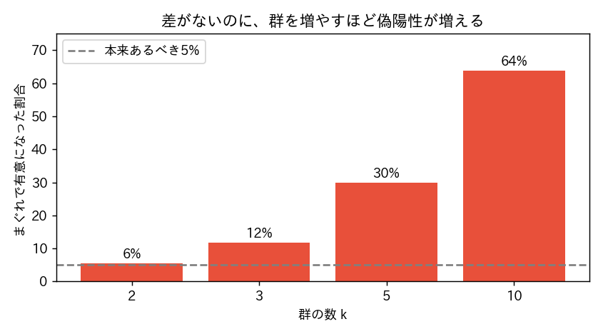

<!-- _class: lead -->
# 第9回　仮説検定(2)
## 分散分析(ANOVA) ―― 繰り返してはいけない

統計学Ⅰ（B）　北星学園大学
小野原 彩香

---

## フック

> 3学部でテスト点に差がある？
> 「**全ペアでt検定**すればいいよね？」
> 経済vs文・文vs社福・経済vs社福…

<br>

## <span class="big">――それ、危ないです</span>

---

## なぜ繰り返しがダメか

1回のt検定は「まぐれで有意」を**5%**許している

<br>

検定を**何回も**やったら？
→ 毎回5%の落とし穴 → どれか1つはまぐれで当たる

---

## 多重比較の罠（差がないのに）



群（＝検定回数）が増えるほど、まぐれの「発見」が増える

---

## だから ANOVA

3群以上を**1回**で「**どこかに差があるか**」判定
→ 検定を繰り返さないので偽陽性が増えない

```python
F, p = stats.f_oneway(経済, 文, 社福)
```

経済58.5 / 文56.4 / 社福56.8 → **F=1.42, p=0.243**
→ 差があるとは言えない（見かけの差にだまされない）

---

## F値の気持ち

$$ F = \frac{\text{群間のばらつき（平均の違い）}}{\text{群内のばらつき（個人差）}} $$

- F 大 ＝ グループ差が個人差より大きい → 差あり
- F ≒ 1 ＝ 個人差の範囲 → 差とは言えない（今回）

---

## 有意だったら：事後検定＋補正

ANOVAが言うのは「**どこかに**差がある」まで

- どのペアかは**事後検定**で
- 繰り返すので**ボンフェローニ補正**（α÷回数）

<br>

❌「ANOVA有意 ＝ 全部の群が違う」（どこかに差、だけ）

---

<!-- _class: lead -->
# まとめ

## 群が3つ以上なら t検定を繰り返さない
## まずANOVAで一括判定

### 「有意」＝どこかに差、≠ 全部違う
### 次回：回帰分析 ―― データを数式で説明する
