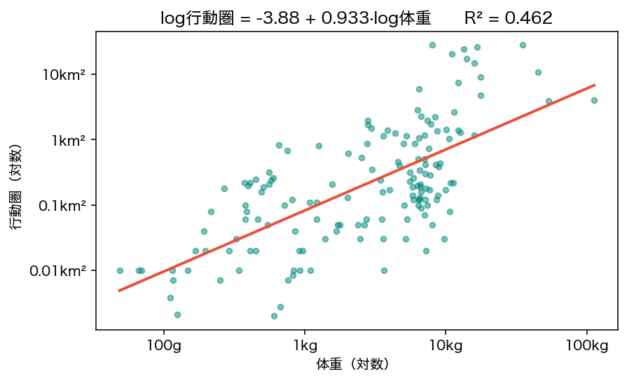
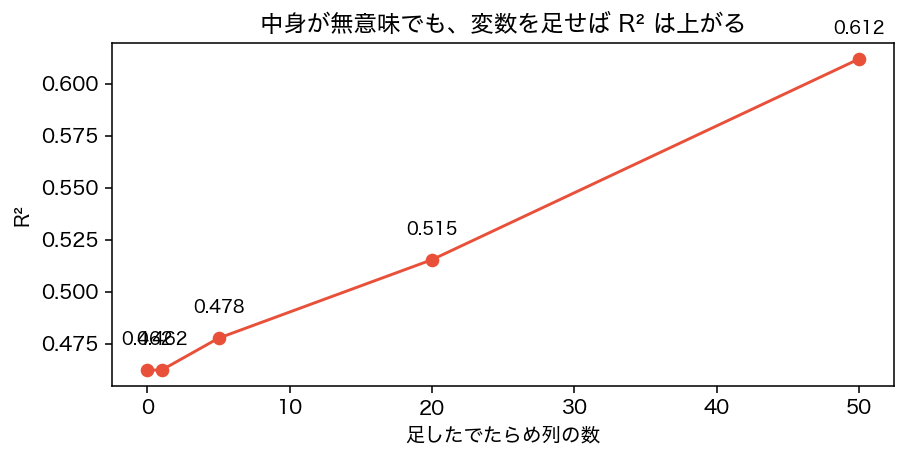

<!-- _class: lead -->
# 第10回　回帰分析
## 単回帰と重回帰 ―― データを数式で説明する

統計学Ⅰ（B）　北星学園大学
小野原 彩香

---

## フック

> 「**栄養段階**（草食/雑食）で行動圏を予測できる？」

直線を引いてみると… **R² ≈ 0**
R²=0.0001。まったく説明できない

 

では **体重** なら？

---

## 単回帰：体重 → 行動圏（両対数）

$$ \log(\text{行動圏}) \approx -3.883 + 0.933 \times \log(\text{体重}) $$

傾き0.933＝**体重10倍で行動圏8.6倍** / R²=0.462（n=153種）

---

## 回帰の言葉

- **傾き(回帰係数)**：xが1増えると予測がいくつ増えるか
- **切片**：x=0のときの予測値
- **R²(決定係数)**：ばらつきのうち説明できた割合(0〜1)

 

## ⚠️ 係数 ≠ 因果

「体重10倍で行動圏8.6倍」は予測上の関連。因果の保証ではない

---

## 重回帰：複数の変数で

$$ \log行動圏 \approx -3.36 + 0.568\,\log体重 + 0.828\,\log集団サイズ $$

各係数＝「**他を一定にしたとき**」の関連（統制）
SNSの−0.8 ＝ 勉強・睡眠が同じ人で比べたSNSの効果

---

## R²の罠：足せば必ず上がる

**でたらめな乱数**を50本足すだけで R² 0.46→0.67

---

## R²が高い ≠ 良いモデル

中身がゴミでも、変数を足せばR²は盛れる

 

## ＝過学習の入り口

手元に合わせすぎ → 未来は当たらない
「当てはまり」vs「複雑さ」をどう釣り合わせる？ → **次回AIC**

---

## 他の罠：外挿と残差

- **外挿**：1トンの霊長類を入れると **52km²**。エラーは出ないが、そんな種はいない
  → データ範囲の外は予測できない
- **残差**（実際−予測）は必ずプロット。偏りがないか見る

---

<!-- _class: lead -->
# まとめ

## モデルは現実の近似
## 当てはまりの良さ ≠ 良いモデル

### 係数を因果と読まず、範囲外を予測せず、残差を見る
### 次回：モデル選択とAIC（オッカムの剃刀）
