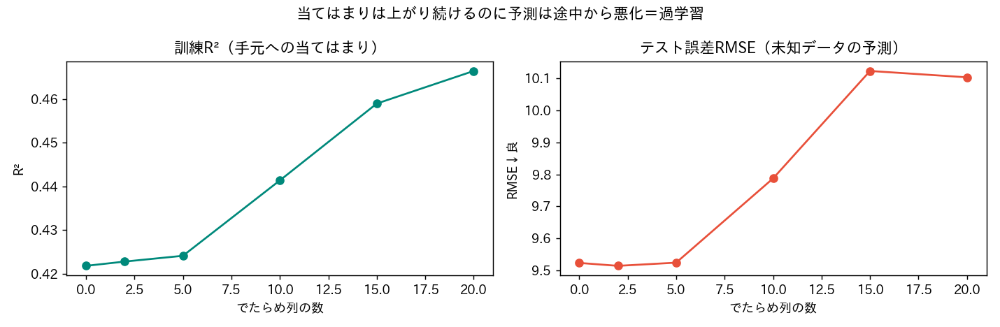
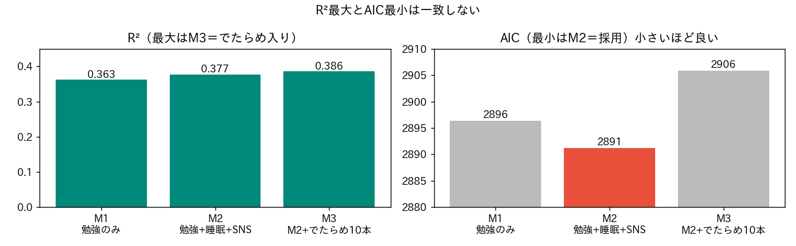

<!-- _class: lead -->
# 第11回　モデル選択とAIC
## 当てはまり vs 複雑さ ―― オッカムの剃刀

統計学Ⅰ（B）　北星学園大学
小野原 彩香

---

## フック

> 変数を増やせば R² は上がり続ける（第10回）

 

## じゃあ全部入れる？
## それで“未来”は当たる？

---

## 過学習を、目で見る

データを 訓練7割／テスト3割 に分けて、見せてない方で予測

当てはまり↑なのに予測は途中から悪化 ＝ **過学習**

---

## 当てはまり ≠ 予測

訓練R²は上がり続ける（手元に合わせるのが上手くなる）
でもテスト誤差は途中から悪化

 

## R²を最大化してはいけない

狙うのは「未知データの予測」

---

## AIC：手元だけで予測の良さを見積もる

$$ \text{AIC} = -2\,(\text{当てはまり}) + 2\,(\text{パラメータ数}) $$

- 当てはまり良 → 第1項↓（AIC下がる）
- 変数多い → 第2項↑（ペナルティ）
- **AICが小さいほど良い**

＝ オッカムの剃刀の定量化

---

## R²最大 と AIC最小 は一致しない

R²最大＝M3（でたらめ入り） / AIC最小＝**M2（採用）**

---

## AICの作法

- **相対指標**：絶対値に意味なし。**差**で比べる（2以上で意味、10で決定的）
- 同じデータ・同じ目的変数で比較
- 「候補の中でのベスト」であって真のモデルの保証ではない

 

❌「AICの絶対値に意味」❌「変数は多いほど良い」

---

<!-- _class: lead -->
# まとめ

## R²最大のモデルとAIC最小のモデルは違う
## 当てはまりと複雑さのバランスで選ぶ

### 次回：ベイズ統計の入り口 ―― データで信念を更新する
