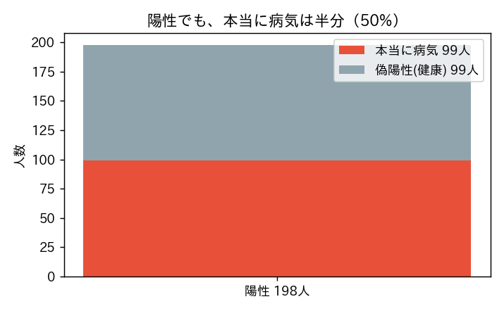
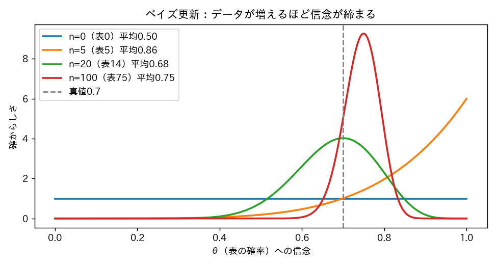

<!-- _class: lead -->
# 第12回　ベイズ統計の入り口
## データで「信念」を更新する

統計学Ⅰ（B）　北星学園大学
小野原 彩香

---

## フック：99%正確な検査で陽性

> 病気の人の99%が陽性、健康な人の99%が陰性。
> あなたは**陽性**。本当に病気の確率は？

 

## 直感：99% もうダメだ…

本当に？

---

## 1万人で考える（有病率1%）

陽性198人のうち本当に病気は99人 → **50%！**

---

## なぜ直感は外れた？

病気の人は元々少ない（1%）
→ 健康なのに偶然陽性（偽陽性）が同じくらい出る

 

## 事前の情報（有病率）を無視したから

それを取り込むのが**ベイズ**

---

## ベイズの3要素

$$ \underbrace{P(\text{病気}\mid\text{陽性})}_{\text{事後}} = \frac{\overbrace{P(\text{陽性}\mid\text{病気})}^{\text{尤度}}\,\overbrace{P(\text{病気})}^{\text{事前}}}{P(\text{陽性})} $$

事前（検査前の信念）× データ → 事後（更新後の信念）

---

## 頻度論 vs ベイズ

| | 頻度論 | ベイズ |
|---|---|---|
| 確率 | 長期的な頻度 | 信念の度合い |
| パラメータ | 固定の定数 | 確率分布を持つ |
| 95%区間 | 信頼区間 | 信用区間（真値が入る確率95%と言える） |

優劣ではなく**世界観の違い**

---

## ベイズ更新を見る（θ＝表の確率）

データが増えるほど信念は真値0.7に締まる（幅0.95→0.17）

---

## 「事前は主観で非科学」？

同じ100回（表75）を正反対の事前を持つ2人が見ると…

| 事前 | 事前平均 | 事後平均 |
|---|---|---|
| 懐疑的 Beta(2,8) | 0.20 | **0.70** |
| 楽観的 Beta(8,2) | 0.80 | **0.75** |

データが増えれば事前の影響は薄まる → 事前は「出発点」

---

<!-- _class: lead -->
# まとめ

## ベイズ＝データで信念を更新する枠組み
## 頻度論と優劣ではなく世界観が違う

### 事前情報を無視すると直感は外れる（検査50%）
### 次回：多変量解析(PCA) ―― 次元を削減して本質を見る
