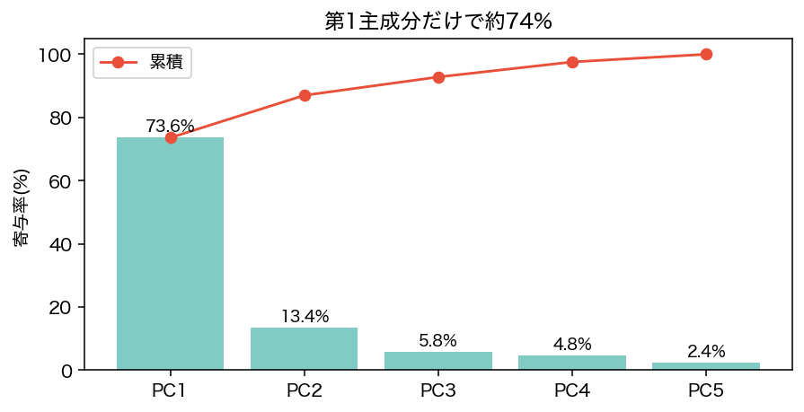
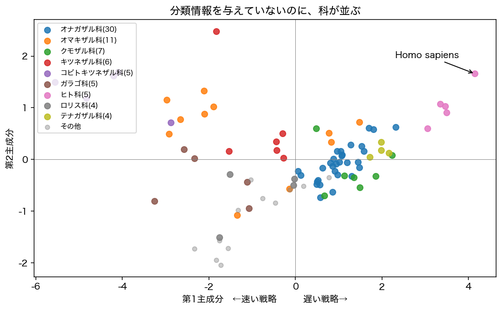

<!-- _class: lead -->
# 第13回　多変量解析への招待
## 主成分分析(PCA) ―― 次元を削減して本質を見る

統計学Ⅰ（B）　北星学園大学
小野原 彩香

---

## フック

> 勉強・睡眠・出席・朝食・SNS… 変数がたくさん
> 全部の関係を一度に見るのは無理
> （5変数で散布図10通り、10変数で45通り）

 

## 本質は、いくつの軸？

---

## PCAの発想

ばらつき（情報）が最大の方向に新しい軸を引き直す

第1主成分だけで**61%**、2つで74% → ほぼ2次元

---

## 主成分を「命名」する（負荷）

| 変数 | 第1主成分 |
|---|---|
| 勉強 | +0.45 |
| 睡眠 | +0.39 |
| 出席 | +0.48 |
| 朝食 | +0.48 |
| SNS | **−0.42** |

勉強・睡眠・出席・朝食(+)、SNS(−) → 《生活の規律》の軸

---

## 5次元を2次元に圧縮

右（遅い戦略）ほどヒト科に近い ＝ 隠れた軸が見えた

---

## 大事な注意

- **PCAは情報を失う**：2軸で74%＝残り**26%は捨てた**
- **主成分に必ず意味があるとは限らない**：今回はたまたま「規律」と読めた。命名は**人間の解釈**
- 軸の向き（符号）は反転しうる

 

❌「PCAで情報は失われない」❌「主成分に必ず明確な意味」

---

<!-- _class: lead -->
# まとめ

## PCA＝変数の背後の少数の軸を見つける道具
## ただし情報は一部失われ、意味づけは人間の解釈

### 次回（最終回）：総括 ―― 第1回の直感クイズに戻る
